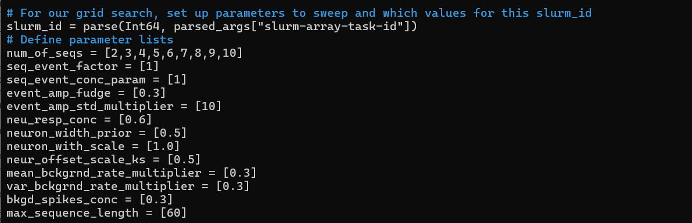

# Hyperparameter Grid Search for PPseq

This repo explains how to perform a hyperparameter grid search for **PPseq**.


---

## Setup on HPC

1. Clone the [PPseq repository](https://github.com/ClementineDomine/Replay) on your HPC:
   ```bash
   git clone https://github.com/ClementineDomine/Replay
   ```

2. Switch to the `masked_XV` branch:
   ```bash
   git checkout masked_XV
   ```

3. Copy the following files into **this** repo:
   - `PPSeq_Interface_hyp_EJTedit.jl` (main interface script)
   - `example_slurm.slurm` (SLURM job script)

4. Navigate to the `PPseq.jl` folder (this is the main published PPseq code).

5. Ensure the repo is on the `master` branch:
   ```bash
   git branch etc... 
   ```

6. Create a conda environment and install **Julia 1.6.5**  
   (this is what I have been using succesfully.. other versions might work also)


## Running PPseq

1. Prepare the data for PPseq by following the instructions here:  
   [sequences_run_PPseq](https://github.com/EmmettJT/sequences_run_PPseq/blob/main/README.md)

2. Edit the hyperparameters in `PPSeq_Interface_hyp_EJTedit.jl` (see next section for guidance).

3. Update the SLURM script (`example_slurm.slurm`) with:
   - Correct paths
   - Animal name
   - Number of jobs (i.e., job array size)
   - etc...

4. Submit the SLURM job:
   ```bash
   sbatch example_slurm.slurm
   ```

## Choosing Hyperparameters

PPseq uses **12 main hyperparameters**.

For detailed descriptions:
- [Original paper (arXiv)](https://arxiv.org/abs/2010.04875)
- Chapter 6.4 of my [PhD thesis](https://discovery.ucl.ac.uk/id/eprint/10184170/)

### Summary:
These parameters are summarised in the table below:


### Editing in the Script

In `PPSeq_Interface_hyp_EJTedit.jl`, locate the section (roughly midway through) where hyperparameters are defined.

- Each parameter is defined as an array.
- The scipt takes these arrays and combines the paramters to create every possible combination
- eg. If all but one have a single value, and one has 9 values (in the example below; the first paramter), then 9 parameter combinations will be created.

Example:



** Note: About 20 lines below, you'll find:
```julia
n_repeats = 5
```
This means each combination will run 5 times.  
So instead of 9 combinations it would actually be 9 × 5 repeats = **45 runs**

> Be careful: combinations scale exponentially.

### Run Count Examples

- **Single value for each parameter**:  
  `(1 × 1 × ... × 1) × 5 = 5 runs`

- **Five values each for 12 parameters**:  
  `(5^12) × 5 = 6,103,515,625 runs`

Make sure to match the run count to your SLURM job array:
```bash
#SBATCH --array=0-4  # For 5 jobs
```

## Analysis:

- there are two analysis scripts in this repo - they are messy and incomplete but they should be helpful for checking the hyperparamter runs.
- '1_PPseq_awake_postprocess_hypersearch' will loop over each file and create raster and tracking alignment plots for each run.
- 'hyperparameter_results' compares the log likleyhood of each model in the sweep 
 


