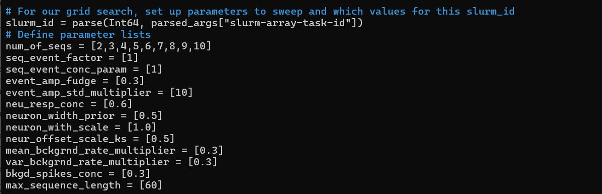

This repo explains how to perform a hyperparater grid search for PPseq  

# Setup grid search version of PPseq on the hpc: 
1. On hpc, clone the sleepuences PPseq repo: https://github.com/ClementineDomine/Replay
2. move to branch 'masked_XV'
3. copy the main file 'PPSeq_Interface_hyp_EJTedit.jl' and the slurm script 'example_slurm.slurm' into this repo. 
4. move inside the PPseq.jl folder (this is the main published PPseq repo) and make sure this repo is on the 'master' branch (git branch etc...)
5. create a conda env and install julia version 1.6.5 (this is what I have been using succesfully.. other versions might work also)

# Running PPseq: 

1. create data for ppseq to run on: To set data up for PPseq runs please see this repo: https://github.com/EmmettJT/sequences_run_PPseq/blob/main/README.md
2. choose hyperparamters to sweep across and edit the main file PPSeq_Interface_hyp_EJTedit.jl for these hyperparams (see below)
3. edit the slurm script so that the paths, animal name, and number of jobs match what you need.
4. run the slurm script with sbatch  

# choosing paramters to sweep across:

PPseq has 12 main hyperparamters.

For a detailed breakdown of each hyperparameter 

please see the origional publication: https://arxiv.org/abs/2010.04875

or chapter 6.4 of my PhD thesis: https://discovery.ucl.ac.uk/id/eprint/10184170/

These parameters are summarised in the table below:

To decide which paramters you wish to sweep through change the paramter settings in the PPSeq_Interface_hyp_EJTedit.jl script. They are somewhere near the middle of the script (not the best placement for them sorry). Sinply add paramters here and the script will create all the possible combinations of them. 
eg. here we are setting all of the paramters as fixed (only 1 number in the field) except for the first paramter which has mutliple - this would create PPseq multiple runs, testing each of the chosen paramter combinations. 

note: about 20 lines beneath this is a variable called 'n_repeats'. by default it is set to 5. This means the grid search will repeat each paramter combination 5 times. 

Because of how these combinations scale the number of runs can quickly get out of hand. 

If you have 1 paramters in each field will mean only n_repeats runs: (1x1x1x1x1x1x1x1x1x1x1x1) x 5  = 5 runs

if you had 5 paramters in each field: (5x5x5x5x5x5x5x5x5x5x5x5x5) x 5 = 6103515625 runs

the number of runs needs to be reflected in the slurm script job array: array=0-4 (for 5 runs)  

_____

