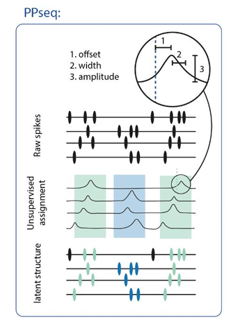
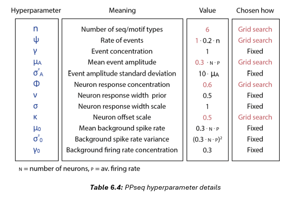

Setup grid search version of PPseq on the hpc: 
1. On hpc, clone the sleepuences PPseq repo: https://github.com/ClementineDomine/Replay
2. move to branch 'masked_XV'
3. move inside the PPseq.jl folder (the main PPseq repo) and make sure this repo is on the 'master' branch (git branch)
4. create a conda env and install julia version 1.6.5 (this is what I have been using succesfully.. other versions might work also)

To run PPseq: 

for a detailed breakdown of each hyperparameter 
please see the origional publication: https://arxiv.org/abs/2010.04875
or chapter 6.4 of my PhD thesis: https://discovery.ucl.ac.uk/id/eprint/10184170/

